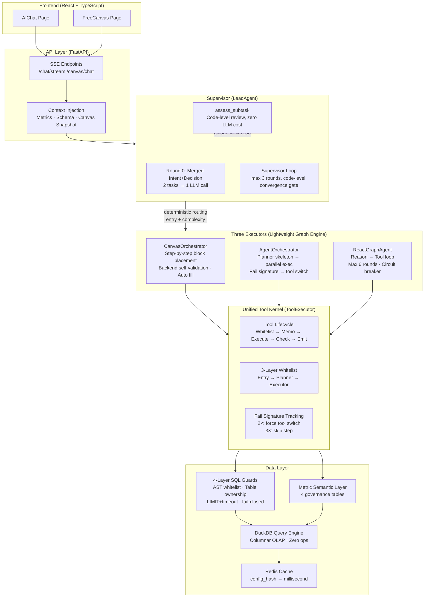

# LvcoBI — AI-Powered Data Analysis Platform (Text-to-BI)

**Turn natural language into insightful data visualizations.**

LvcoBI is a full-stack BI SaaS platform that lets users interact with their data through natural language. It features a custom multi-agent orchestration engine, a metric semantic layer, and a canvas-based drag-and-drop visualization workspace — all powered by LLM agents.

[](https://www.python.org/)
[](https://fastapi.tiangolo.com/)
[](https://react.dev/)
[](https://duckdb.org/)
[](LICENSE)

---

## Architecture Overview



### Key Design Points

| Point | What | Why |
|-------|------|-----|
| **A** | Merged intent+decision (Round 0) | One LLM call, 40% token savings |
| **B** | Executor tool whitelist narrowed to placement-only | Prevents "query but don't chart" |
| **C** | fail_signature tracking | Same signature 2× fail → force switch; 3× → skip |
| **D** | SQL 4-layer fail-closed | Parse failure → reject, never downgrade |

---

## Rich Architecture SVG

<div align="center">
  
</div>

> **Note**: If the SVG isn't rendering yet, push this README first — the `docs/architecture.svg` will be generated on the next build.

---

## Project Flow (Canvas Conversation Example)

```
User: "Analyze sales by category, brand, and season"
   │
   ▼
① Frontend (AIChat/FreeCanvas)
   │ POST /api/v1/ai/canvas/chat (SSE stream)
   │ Zustand store: stream survives route switches
   ▼
② API Layer
   │ Inject: canvas snapshot + governed metrics list
   │ Session: 1:1 binding per canvas
   ▼
③ LeadAgent (Supervisor)
   │ Round 0: merged intent+decision → intent=analysis, action=call_analysis
   │ Code routing: entry=canvas → CanvasOrchestrator (zero LLM cost)
   ▼
④ CanvasOrchestrator
   │ plan → execute_steps → finish
   │ Planner generates skeleton (3 chart steps + narrative)
   │ Mini-ReAct loop: LLM → ToolExecutor → goal validation
   │ Auto chart filling (if <2 chart types, auto-fill one)
   │ Auto layout arrange (deterministic, not LLM-triggered)
   ▼
⑤ ToolExecutor
   │ Whitelist check → idempotent memo → execute → error check → emit
   │ add_chart_block: back-end self-validation via execute_chart_query
   ▼
⑥ Review & Memory
   │ assess_subtask: 4-dimension code review (zero LLM)
   │ Pass → STOP; Fail → guidance → redo
   │ _maybe_summarize: early rounds → LLM summary → ai_memories upsert
   ▼
   SSE: intent → decision → progress → tool_call → canvas_action → done
   Frontend renders canvas blocks in real-time
```

---

## Multi-Agent Orchestration

| Component | Role | Mechanism |
|-----------|------|-----------|
| **Lead Agent** | Supervisor state machine | Merged Round 0 + convergence gate + subtask review |
| **Canvas Executor** | Step-by-step canvas charting | Tool whitelist narrowed to placement-only; self-validating add_chart_block |
| **General Executor** | Multi-step complex analysis | Planner skeleton → topological parallel execution → fail-signature tracking |
| **React Executor** | Lightweight Q&A | Reason→Tool loop; max 6 rounds; 5-consecutive-fail circuit breaker |

### Three Query Paths

| Path | Tool | When | Security |
|------|------|------|----------|
| **Governed Metric** | `metric_key` | Business metrics with defined caliber | Formula AST whitelist; auto-upgrade to governed caliber |
| **Structured Query** | `query_engine` | Flexible aggregation/grouping/filtering | Parameterized SQL, injection-proof |
| **Raw SQL** | `query_sql` | Complex analytics (window functions, CTEs) | 8-rule AST validation + table ownership + fail-closed |

### Evaluation Results

| Suite | Tests | Pass Rate |
|-------|-------|-----------|
| Agent E2E (Semantic Eval) | 20 dual-source canvas | **90.8%** (14/20 full pass) |
| LLM Full-Chain | 21/21 | 100% |
| Metric Semantic Layer | 25/25 | 100% |
| SQL Safety (AST guard) | 21/21 | 100% |
| Output Efficiency Baseline | 25 questions (historic) | 48% → **96%** |

---

## Tech Stack

| Layer | Technology |
|-------|-----------|
| **Backend** | Python 3.12 • FastAPI • SQLAlchemy • Alembic • PostgreSQL |
| **Query Engine** | DuckDB (columnar OLAP, embedded, zero ops) |
| **Cache** | Redis |
| **Frontend** | React 18 • TypeScript • Vite • ECharts 5 • Zustand |
| **AI/Agent** | OpenAI-compatible LLM • Langfuse (observability) • Custom graph engine |
| **Security** | SQLGlot AST-level whitelist • Parameterized queries • RBAC |
| **Deployment** | Docker • Docker Compose • Nginx |

---

## Quick Start

```bash
# Prerequisites: Python 3.12+, Node.js 18+, PostgreSQL 15+, Redis 7+

# Backend
cd backend
cp .env.example .env    # configure DB connection, LLM API key
uv venv
source .venv/bin/activate  # or .venv\Scripts\activate on Windows
uv pip install -r requirements.txt
alembic upgrade head
uvicorn app.main:app --reload

# Frontend (separate terminal)
cd frontend
npm install
npm run dev

# Or Docker (full stack)
docker compose up -d
```

---

## Testing

```bash
cd backend
pytest                          # unit + integration
python -m tests.agent_evals.semantic_run_eval  # agent evaluation
```

---

## Project Structure

```
lvco-bi/
├── backend/
│   ├── app/
│   │   ├── api/              # REST endpoints (14 modules)
│   │   ├── core/             # Database, security, SSE, middleware
│   │   ├── models/           # SQLAlchemy models (20+)
│   │   ├── repositories/     # Data access (UoW pattern)
│   │   ├── services/
│   │   │   ├── agents/       # Multi-agent orchestration engine
│   │   │   │   ├── lead/     # Supervisor (LeadAgent)
│   │   │   │   ├── canvas_orchestrator.py
│   │   │   │   ├── agent_orchestrator.py
│   │   │   │   ├── react_agent.py
│   │   │   │   ├── planner_agent.py
│   │   │   │   └── tool_executor.py
│   │   │   ├── metric_service.py  # Metric semantic layer
│   │   │   ├── query_engine.py    # Structured query engine
│   │   │   ├── sql_guard_ast.py   # AST-based SQL protection
│   │   │   ├── observability.py   # Langfuse integration
│   │   │   └── ...
│   │   └── config.py
│   ├── prompts/              # 18 LLM system prompts (YAML)
│   ├── mock_data/            # 6 sample datasets
│   └── tests/                # 50+ test files
├── frontend/
│   └── src/
│       ├── pages/            # 14 page modules
│       ├── components/       # UI components + charts
│       └── stores/           # Zustand state management
└── docker-compose.yml
```

---

## License

MIT