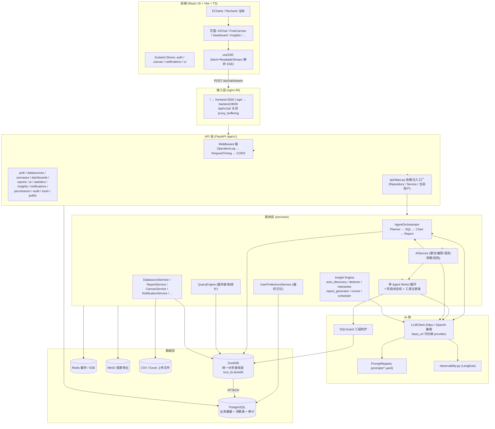
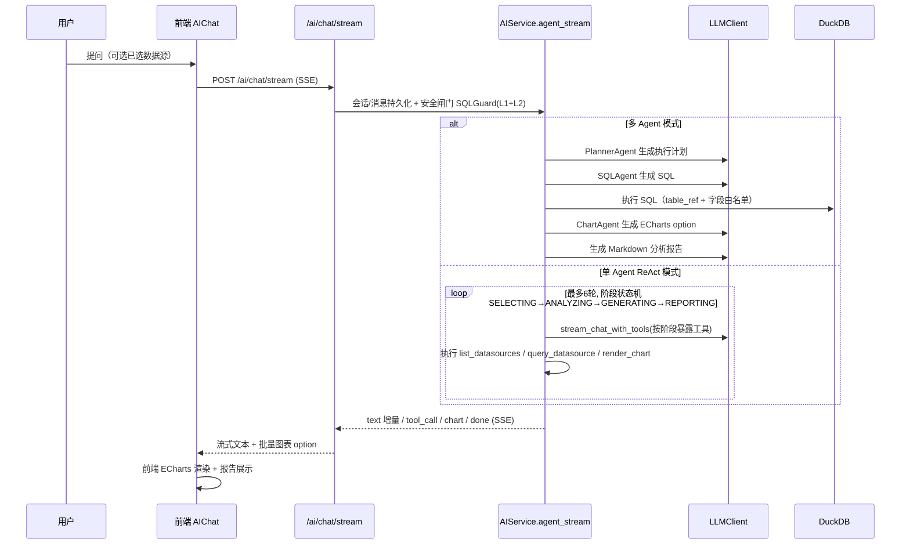
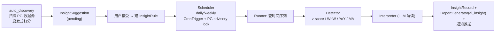
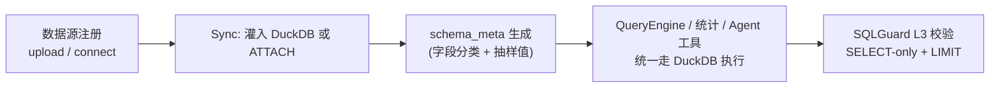
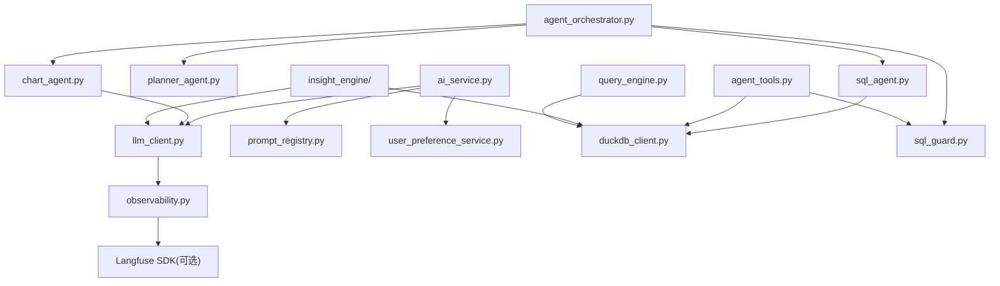

# 02 · 整体架构

## 架构图

## 分层职责

| 层 | 目录 | 职责 |
|----|------|------|
| API 层 | `app/api/v1/` | 路由定义、请求/响应校验（Pydantic）、限流、SSE 流式封装 |
| 装配层 | `app/api/deps.py` | 依赖注入：JWT 用户 + Repository/Service 工厂（**唯一装配点**） |
| 服务层 | `app/services/` | 业务逻辑：AI 全链路、Agent、洞察引擎、查询引擎、数据源、报表等 |
| 仓储层 | `app/repositories/` | 数据访问：Protocol 接口 + SQLAlchemy 实现 + 缓存实现（Redis/内存/降级） |
| 模型层 | `app/models/` | SQLAlchemy ORM 模型 + 枚举（15 张表） |
| 核心层 | `app/core/` | 横切组件：DB 引擎、DuckDB 客户端、安全、中间件、SSE、限流、操作日志 |
| 连接器层 | `app/connectors/` | 数据源抽象与实现（CSV/Excel/MySQL/PostgreSQL） |
| 前端 | `frontend/src/` | React 页面、Zustand、SSE hooks、图表组件 |

## 核心数据流

### 1. 自然语言 → 图表（AI 主链路）

### 2. 洞察引擎定时流程

### 3. 数据源查询统一入口

## 关键设计决策（ADR 摘要）

| 决策 | 选择 | 原因 |
|------|------|------|
| 分析引擎 | DuckDB 而非直接查 PG | 统一多数据源查询、列式分析性能、无额外服务 |
| LLM 接入 | 裸 httpx 走 OpenAI 兼容协议 | 一套代码兼容 DeepSeek/通义/OpenAI 等任意 provider |
| 数据库访问 | SQLAlchemy 2 异步 + 仓储模式 | 高并发、可测试（Protocol 支持 mock）、UoW 统一事务 |
| Agent 架构 | 编排 + ReAct 双模式 | 简单任务快、复杂任务结构化；Feature Flag 可灰度 |
| Prompt 管理 | YAML 外部化 + 注册中心 | 产品/运营可迭代提示词，无需改代码重启 |
| 可观测 | Langfuse 四层埋点 | 端到端追踪 LLM 调用成本与质量，未配置零侵入 |
| PDF 导出 | 子进程 Playwright | 规避 Windows ProactorEventLoop 限制 |

## 模块依赖关系（后端 services 层）

