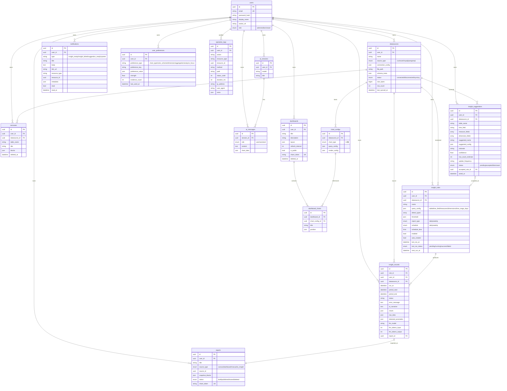

# 06 · 数据模型与 E-R 图

> 全部模型位于 `app/models/`，主键均为 `UUID(as_uuid=True)`（PG 端 `uuid_generate_v4()`），时间戳来自 `TimestampMixin`（created_at/updated_at）。

## E-R 图

## 模型清单与要点

| 模型文件 | 表名 | 关键要点 |
|----------|------|---------|
| `user.py` | users | `UserRole` 枚举 admin/editor/viewer；关系级联删除 |
| `datasource.py` | datasources | `SourceType`(csv/excel/mysql/postgresql)、`DatasourceStatus`；connection_config 存加密连接串；schema_meta 存字段分类 |
| `canvas.py` | canvases | blocks JSON 存画布块；软删除 |
| `chart_config.py` | chart_configs | `ChartType` 枚举 **14 种**：bar/line/pie/area/scatter/funnel/radar/heatmap/sankey/horizontal_bar/grouped_bar/stacked_bar/kpi_card/donut |
| `dashboard.py` | dashboards | layout JSON、refresh_interval(300)、share_token、软删除 |
| `dashboard_chart.py` | dashboard_charts | position JSON 布局 |
| `report.py` | reports | `ReportStatus`(draft/published/shared/deleted)、`ReportSourceType`(canvas/dashboard/manual/ai_insight)；snapshot_blocks 快照 |
| `ai_session.py` | ai_sessions | model 字段（默认 gpt-4o） |
| `ai_message.py` | ai_messages | chart_data JSON 存图表 option；role 枚举 |
| `insight_rule.py` | insight_rules | `ReportType`/`ScheduleType`/`RunStatus` 枚举；部分索引 `(user_id, enabled) WHERE enabled` |
| `insight_record.py` | insight_records | 存 ai_narrative/charts/raw_data/detected_anomalies/llm tokens |
| `insight_suggestion.py` | insight_suggestions | `SuggestionStatus`；accepted_rule_id 关联 |
| `notification.py` | notifications | `NotificationType`(insight_ready/insight_failed/suggestion_ready/system) |
| `operation_log.py` | operation_logs | 审计日志（中间件写入），action/resource_type/resource_id 均建索引 |
| `user_preference.py` | user_preferences | 偏好记忆：strength(0-1)/evidence_count/衰减字段 |
| `base.py` | — | `Base` + `TimestampMixin` |

## 关系汇总

- **User 1—N**：DataSource / Canvas / Dashboard / Report / AISession / UserPreference / Notification
- **DataSource 1—N**：Canvas / ChartConfig / InsightRule / InsightRecord / InsightSuggestion
- **Dashboard 1—N** DashboardChart **N—1** ChartConfig
- **AISession 1—N** AIMessage
- **InsightRule 1—N** InsightRecord；InsightRecord **N—1** Report（report_id）；InsightSuggestion **N—1** InsightRule（accepted_rule_id）

## 注意

- `models/__init__.py` 未导出 insight_record / insight_rule / insight_suggestion 三个模型，需直接 `import` 具体模块。
- 0013 迁移建 `user_preferences` 时未建 FK 约束（模型声明了 ForeignKey，属历史遗留差异）。
- 图表类型扩展经历 4 个迁移（0003/0008/0009-horizontal/0010），见 [09-backend-connectors-migrations.md](./09-backend-connectors-migrations.md)。
